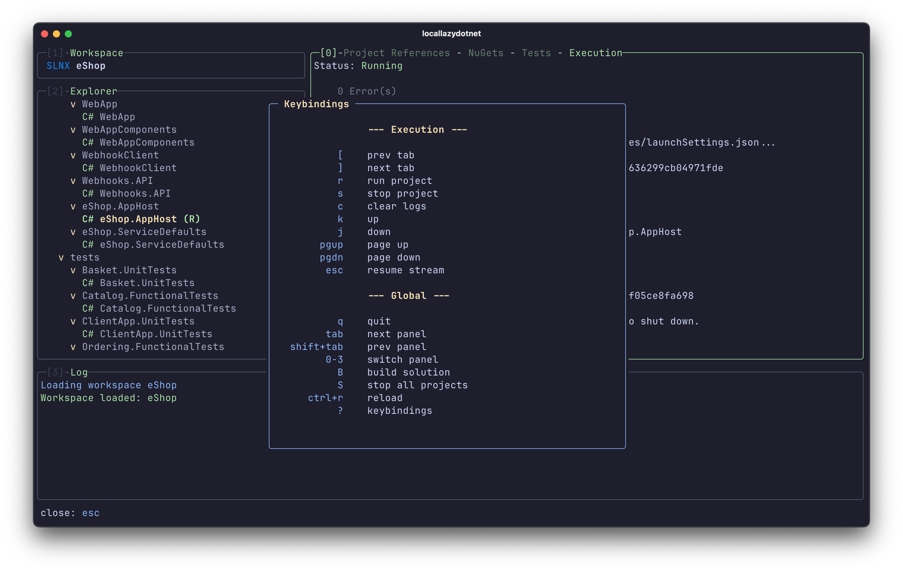

# lazydotnet

A terminal-based UI for managing .NET solutions and projects, inspired by [lazygit](https://github.com/jesseduffield/lazygit).

lazydotnet provides an interactive, keyboard-driven interface for common .NET development tasks. Navigate your solution structure, build and run projects, manage NuGet packages, and run tests—all without leaving your terminal.


https://github.com/user-attachments/assets/758228fc-582a-4820-9672-97bda2050562


**Important:** This project does **not** include LSP (Language Server Protocol) functionality or debugging capabilities. It focuses on solution/project management and execution tasks.

## Requirements

- [.NET 10 runtime](https://dotnet.microsoft.com/download/dotnet/10.0) or later

## Installation

```bash
dotnet tool install --global lazydotnet
```

To update to the latest version:

```bash
dotnet tool update --global lazydotnet
```


```bash
dotnet tool install --global dotnet-outdated-tool
```

## Usage

```bash
# Open current directory (auto-detects solution)
lazydotnet

# Open specific solution
lazydotnet MySolution.sln

# Open specific project
lazydotnet --project MyProject.csproj

# Open specific directory
lazydotnet /path/to/project

# Open with explicit solution file
lazydotnet -s MySolution.sln
```

## Features

### Solution Explorer

- **Hierarchical tree view** of your solution structure
- Navigate projects and nodes with vim-style keybindings (`j`/`k`) or arrow keys
- Expand/collapse nodes and project groups
- Visual indicators for running projects with `[green](R)[/]` marker
- Supports `.sln`, `.slnx`, `.slnf`, and `.csproj` files

### Project Management

- **Build** individual projects or the entire solution (`b` / `B`)
- **Run** projects with live log streaming (`r`)
- **Stop** running project (`s`)
- **Edit** project files in the editor (`e`)

### Project References Tab


- View all project references for the selected project
- **Add** new project references from a picker dialog (`a`)
- **Remove** existing references with confirmation (`d`)
- Jump to referenced projects in the explorer (`Enter`)
- Open referenced projects in your editor (`e`)

### NuGet Packages Tab


- View all NuGet packages with current and latest versions
- **Color-coded version indicators:**
  - Green: Patch update available (safe)
  - Yellow: Minor update available (non-breaking)
  - Red: Major update available (potentially breaking)
- **Add** new packages via search dialog (`a`)
- **Update** individual packages to latest version (`u`)
- **Update all** outdated packages with strategy selection (`U`)
  - Patch (Safe): Bug fixes only
  - Minor (Non-breaking): New features
  - Major (Breaking): Upgrade everything
- **Remove** packages (`d`)
- **Version picker** with available versions (`Enter`)

### Tests Tab


- **Automatic test discovery** for all test providers (xUnit, NUnit, MSTest, etc.)
- **Dual protocol support**: VSTest (legacy) and Microsoft Testing Platform (MTP)
- Hierarchical test tree view (namespaces → classes → methods)
- **Run** individual tests, test classes, or entire namespaces (`r`)
- **Filter tests** by status (`f`): All, Running, Failed, or Passed
- **View test details** including error messages, stack traces, and output (`Enter`)
- Navigate to test source code (`e`)

### Execution Tab


- **Live log streaming** from running projects
- Auto-scroll to latest output (can be paused)
- Navigate log history with `j`/`k` or arrow keys
- **Run** the current project (`r`)
- **Stop** the running project (`s`)
- **Clear** execution logs (`c`)
- Resume auto-scroll with `Esc`

### Workspace Management


- Switch between different solutions in the same directory
- Solution picker dialog for directories with multiple `.sln` files
- Support for solution filters (`.slnf`) and XML-based solutions (`.slnx`)

### Editor Integration

- Automatic in-editor detection: (Zed, VS Code, Cursor, etc)
- Open project files, test files
- Line number navigation for test failures

### Global Features



- **Panel navigation:** `Tab` / `Shift+Tab` or number keys `0-3`
- **Reload** current project/solution data (`Ctrl+R`)
- **Keybindings help** (`?`) showing context-sensitive shortcuts
- **Build solution** (`Shift+B`)
- **Stop all running projects** (`Shift+S`)

## Keybindings

### Global

| Key         | Action                                                      |
| ----------- | ----------------------------------------------------------- |
| `q`         | Quit                                                        |
| `?`         | Show keybindings help                                       |
| `Tab`       | Next panel                                                  |
| `Shift+Tab` | Previous panel                                              |
| `0-3`       | Switch to panel (0=Details, 1=Workspace, 2=Explorer, 3=Log) |
| `B`         | Build solution                                              |
| `S`         | Stop all running projects                                   |
| `Ctrl+R`    | Reload current project/solution                             |

### Explorer Panel

| Key               | Action                    |
| ----------------- | ------------------------- |
| `j` / `↓`         | Move down                 |
| `k` / `↑`         | Move up                   |
| `Ctrl+D` / `PgDn` | Page down                 |
| `Ctrl+U` / `PgUp` | Page up                   |
| `h` / `←`         | Collapse node             |
| `l` / `→`         | Expand node               |
| `Enter` / `Space` | Toggle expand/collapse    |
| `e`               | Edit in editor            |
| `b`               | Build selected project(s) |
| `r`               | Run selected project(s)   |
| `s`               | Stop selected project     |

### Details Panel (Tabs)

| Key | Action       |
| --- | ------------ |
| `[` | Previous tab |
| `]` | Next tab     |

#### Project References Tab

| Key       | Action                    |
| --------- | ------------------------- |
| `j` / `k` | Navigate references       |
| `a`       | Add reference             |
| `d`       | Remove selected reference |
| `e`       | Edit referenced project   |
| `Enter`   | Select in explorer        |

#### NuGet Tab

| Key       | Action                       |
| --------- | ---------------------------- |
| `j` / `k` | Navigate packages            |
| `a`       | Add package                  |
| `u`       | Update selected package      |
| `U`       | Update all outdated packages |
| `d`       | Remove selected package      |
| `Enter`   | Open version picker          |

#### Tests Tab

| Key       | Action                                         |
| --------- | ---------------------------------------------- |
| `j` / `k` | Navigate tests                                 |
| `h` / `l` | Collapse/expand                                |
| `Space`   | Toggle expand/collapse                         |
| `f`       | Cycle filter (All → Running → Failed → Passed) |
| `r`       | Run selected test(s)                           |
| `e`       | Edit test file                                 |
| `Enter`   | View test details                              |

#### Execution Tab

| Key       | Action             |
| --------- | ------------------ |
| `j` / `k` | Navigate log lines |
| `r`       | Run project        |
| `s`       | Stop project       |
| `c`       | Clear logs         |
| `Esc`     | Resume auto-scroll |

## Configuration examples

### Zed Integration
> lazydotnet is not a replacement for the [Zed c#](https://zed.dev/extensions/csharp) extension. It can complement it.

Add this task to your `.zed/tasks.json`:
```json
[
  {
    "label": "lazydotnet",
    "command": "lazydotnet",
    "use_new_terminal": false,
    "allow_concurrent_runs": false,
    "reveal": "always",
    "reveal_target": "center",
    "hide": "always",
    "shell": {
      "program": "sh"
    }
  }
]
```

Then add a keybinding to your `.zed/keymap.json`. For example:

```json
[
  {
    "context": "Workspace",
    "bindings": {
      "cmd-shift-d": [
        "task::Spawn",
        {
          "task_name": "lazydotnet",
          "reveal_target": "center"
        }
      ]
    }
  }
]
```

Now you can launch lazydotnet with `Cmd+Shift+D` from Zed.

> For Vim mode users, you can use a more specific context like `"context": "Editor && VimControl && !VimWaiting && !menu"` and bind to `space . .` or any key combination you prefer.

## Acknowledgments

- This project is based on the idea of [lazygit](https://github.com/jesseduffield/lazygit). 
- Special thanks to [easy-dotnet](https://github.com/GustavEikaas/easy-dotnet.nvim) for the inspiration.
- Built with [Spectre.Console](https://spectreconsole.net/) for beautiful terminal UI.

## Alternatives

- **[easy-dotnet.nvim](https://github.com/GustavEikaas/easy-dotnet.nvim)** - A Neovim plugin for .NET development.
- **[DotRush](https://github.com/JaneySprings/DotRush)** - A VS Code extension alternative to C# Dev Kit that works in all VS Code forks.

## License

MIT License - See [LICENSE](LICENSE) for details.

## Contributing

Contributions are welcome! Please feel free to submit a Pull Request.
